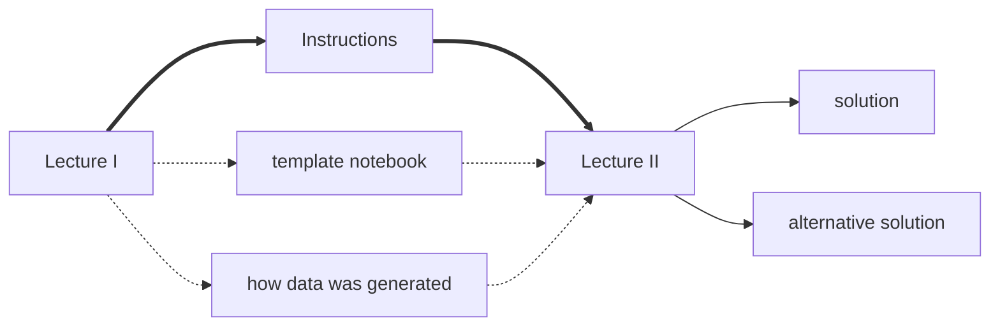

```mermaid
flowchart LR
A[Lecture I] ==> B[Instructions]
A -.-> G[how data was generated]
A -.-> C[template notebook]
B ==> D[Lecture II]
C -.-> D
G -.-> D
D --> E[solution]
D --> F[alternative solution]
click A "video 1" "A lecture that was given on February 1st 2021 as part of the plumed masterclass series that introduces you to the exercises in this lesson"
click B "README" "The instructions for the exercises"
click G "notebooks/gendata.ipynb" "A python notebook that shows how the data sets in the files uncorrelated_data, correlated_data and weighted data that are all used in the exericses was generated"
click C "notebooks/template.ipynb" "A python notebook file that explains how you can work on the exercises from a python notebook.  Advice on running PLUMED from a notebook and on plotting the data that is generated is given.
"
click D "video 2" "A lecture that was given on February 8th 2021 as part of the plumed masterclass series that goes through the solutions to the exercises in the lesson"
click E "notebooks/solution.ipynb" "A python notebook file that provides a complete set of solutions to the exercises"
click F "notebooks/answers_notebook.ipynb" "A second python notebook file that contains solutions to the exercises.  In this notebook a different method has been used to generate the figures showing the final free energy surfaces.
"
```
