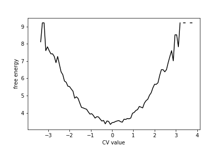
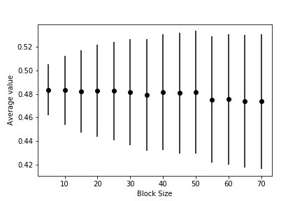

# PLUMED Masterclass 21.2: Statistical errors in MD

## Aims

In this Masterclass, we will discuss how to report the results from molecular simulations.  
We will emphasize that any result that we get from any simulation is a random variable.
To make the result reproducible, we must characterize the distribution
that has been sampled.  It is not sufficient to report the averages.

## Objectives

Once you have completed this Masterclass you will be able to:

- Use PLUMED to calculate time averages and histograms from biased and unbiased simulation data.
- Use PLUMED to perform block averaging.
- Calculate error bars on-time averages computed form biased and unbiased simulation data using the central limit theorem and non-parametric bootstrap.
 
## Setting up PLUMED

If you have not yet set up PLUMED, you can find information about installing it [here](https://www.plumed.org/doc-v2.8/user-doc/html/masterclass-21-1.html). Please ensure that you have setup PLUMED on your machine before starting the exercises.

## Resources

The data needed to execute the exercises of this Masterclass can be found on [GitHub](https://github.com/plumed/masterclass-21-2).
You can clone this repository locally on your machine using the following command:

````
git clone https://github.com/plumed/masterclass-21-2.git
````

The data you need is in the folder called `data`.  You will find the following files in that folder:

- `uncorrelated_data`: you will analyze this data set in the first six exercises that follow
- `correlated_data`: you will analyze this data set in exercise 7
- `weighted_data`: you will analyze this data in exercise 8

In exercise 9, you will pull everything together by generating a metadynamics trajectory.  This exercise draws together all the ideas from exercises 1-8 by getting you to run a metadynamics simulation and extract the free energy surface.  In the `data` folder, you will thus also find the following files, which 
are the input for the metadynamics simulation:

- in: The input file for simplemd that contains the parameters for the MD simulation.
- input.xyz: An initial configuration for the cluster that we are studying in this tutorial. 

Notice that PLUMED input files have not been provided in the GitHub repository.  You must prepare these input files yourself using the templates below.

We would recommend that you run each exercise in separate sub-directories inside the root directory `masterclass-21-2`.

## Background

In other lessons you have seen how PLUMED can be used to calculate the value of a collective variables, $s(\mathbf{x})$,
from the positions of the atoms, $\mathbf{x}$.  You should also have seen that doing so allows you to describe the conformational 
changes or chemical reactions that have occured during your molecular dynamics trajectory.  We will build on this idea in this tutorial
by recalling that the values for collective variable we calculate for the frames of a constant-temperature molecular dynamics trajectory 
are samples from the probability distribution for [the canonical (NVT) ensemble](https://www.notion.so/The-canonical-NVT-ensemble-112c3f99f215472cae55d5f6c36f4599):

$$
P(s') = \frac{ \int \textrm{d}x \textrm{d}p \delta( s(x) - s') e^{-\frac{H(x,p)}{k_B T}} }{ \int \textrm{d}x\textrm{d}p e^{-\frac{H(x,p)}{k_B T}} }
$$

where $k_B$ is Boltzmann's constant, $T$ is the temperature $H(x,p)$ is the Hamiltonian and $\delta$ is a Dirac delta function.  Notice also that the integrals 
in the numerator and denominator are integrals over all of [phase space](https://www.notion.so/Microstates-phase-space-and-the-principle-of-equal-a-priori-probabilities-9dbd484a47654bff858313634f01d875).  If $N$ is 
the number of atoms in our system we must, therefore, integrate over each of the $3N$ momentum ( $p$ )
and $3N$ position ( $x$ ) coordinates when calculating these integrals.  

It is only possible to calculate the integrals in the quotient above exactly for elementary physical systems.  For more complex systems we thus assume that we 
can extract information on $P(s')$ by sampling from this distribution multiple times (using molecular dynamics or Monte Carlo) and using the tools of [statistics](https://www.notion.so/940bd09c5be343888244beb21ed4a166?v=6bb0bd98d8fc47a081164069121ee396).
Critically, however, any result we get from such simulations is a [random variable](https://www.notion.so/Random-variables-8aad5b4c3453423da3069168228fe890). <b>To make our results [reproducible](https://www.notion.so/Reproducibility-2494dddd51a14d34bddbb40bb32f7ebc) 
we thus need to characterize the [distribution](https://www.notion.so/The-cumulative-probability-distribution-function-dc346bc8b4f1440b8d075f8c8d2b0f53) sampled in our simulation.</b>  
Reporting only the average value we get is not sufficient as any [averages we take are random](https://www.notion.so/Sample-mean-583d58d7001343c68a7956a1b9f19f4b). 

<em>Links to background information on statistical mechanics and statistics are provided throughout this tutorial.  You can complete the tutorial without looking at the information at these links.
However, we hope that the information we have provided through these links will prove useful if you want to do a more in-depth study of the topic.</em> 

## Exercises

### Exercise 1: Calculating the average value of a CV 

We will start our study of averaging by estimating the [ensemble](https://www.notion.so/Ensembles-7b8b836f8ce44f9b8830ebb0fd00fea8) average of the CV.  The ensemble average for $s(x)$ is given by:

$$
\langle s \rangle = \frac{ \int \textrm{d}x \textrm{d}p s(x) e^{-\frac{H(x,p)}{k_B T}} }{ \int \textrm{d}x\textrm{d}p e^{-\frac{H(x,p)}{k_B T}} }
$$ 

In statistics, the quantity known as the ensemble average in statistical mechanics is referred to as the [expectation](https://www.notion.so/Expectation-c877d8e2ab444b818fae6c053598e0af) of the random variable's 
[distribution](https://www.notion.so/The-cumulative-probability-distribution-function-dc346bc8b4f1440b8d075f8c8d2b0f53).
The expectation of a random variable is often esimated by taking multiple identical samples from the distribution, $X_i$ and computing a [sample mean](https://www.notion.so/Sample-mean-583d58d7001343c68a7956a1b9f19f4b) as follows:

$$
\overline{X} = \frac{1}{N} \sum_{i=1}^N X_i
$$

We can do the same with the data from our MD trajectory.  We replace the $X_i$ in the equation above with the CV values calculated for each of our trajectory frames.

To calculate averages using PLUMED, you can use the input file below.  This input calculates averages for the data in the `uncorrelated_data` file you downloaded when you collected the GitHub repository.  

```plumed
#SOLUTIONFILE=work/plumed_ex1.dat
data: READ FILE=__FILL__ VALUES=__FILL__
av: AVERAGE ARG=__FILL__ STRIDE=1
PRINT ARG=av FILE=colvar
```

<b>Copy the input to a file called plumed.dat, fill in the blanks and  run the calculation by executing the following command:</b>

````
> plumed driver --noatoms
````

The `colvar` file that is output by PLUMED contains the average computed value from progressively larger and larger numbers of CV values.  You should thus 
be able to use the data in `colvar` to produce a graph that shows the average as a function of the number of variables it is computed from as shown below.

 

The fluctuations in the average get smaller as this quantity is computed from larger numbers of random variables.  We say that the average thus converges to the ensemble average, which is zero for the graph above. 

### Exercise 2: Calculating the free energy

We can estimate the distribution for our CV, $P(s')$, by calculating [a histogram](https://www.notion.so/Histogram-2d2527795f0140008b318d3bc958ee4c).  The histogram we obtain is a 
sample from [a multinomial distribution](https://www.notion.so/Multinomial-distribution-f378b34a38564f6999e184cd2df53f5c) so we can estimate parameters for the multinomial by using 
[likelihood maximisation](https://www.notion.so/Maximum-likelihood-e74a16b691284896bb2bbd5cff502f6d).  Once we have the marginal 
distribution, $P(s')$ we can then calculate the [free energy](https://www.notion.so/Thermodynamic-potentials-dd0dcbab15cd437b91e803ac7fbd1bf8), $F(s')$ as a function of $s(x)$ as $F(s')$ is related to $P(s')$ by:

$$
F(s') = - k_B T \ln P(s')
$$

If we estimate $P(s')$ using likelihood maximisation we can thus get an estimate of the free energy surface.  To estimate the free energy surface 
for the data in `uncorrelated_data` using PLUMED in this way we can use the input file:

```plumed
#SOLUTIONFILE=work/plumed_ex2.dat
# We use natural units here so that kBT is set to 1
UNITS NATURAL
data: READ FILE=__FILL__ VALUES=__FILL__ 
hhh: HISTOGRAM ARG=__FILL__ STRIDE=1 __FILL__=-4.5 __FILL__=4.5 __FILL__=100 __FILL__=DISCRETE
fes: CONVERT_TO_FES GRID=__FILL__ TEMP=1  # This sets k_B T = 1 
DUMPGRID GRID=__FILL__ FILE=fes.dat
```

<b>Copy this input to a file called plumed.dat, fill in the blanks so that you have a grid that runs from -4 to +4 with 100 bins.  Run the calculation by executing the following command:</b>

````
> plumed driver --noatoms
````

The `--noatoms` flag here is needed since `plumed driver` is commonly used to analize a trajectory of atomic coordinates, but here we are using it to directly analyze a collective variable.

You should see that the free energy curve for this data set looks like this:



As you can see, there is a single minimum in this free energy surface.

#### Exercise 3: Calculating the fluctuations for a CV

Physical systems spend the majority of their time fluctuating around minima in the free energy landscape.  Let's suppose that this minima is at $\mu$ and lets 
use the Taylor series to write an expression for the free energy at $s'$ as follows:

$$
F(s) = F(\mu) + F'(\mu)(s-\mu) + \frac{F''(\mu)(s-\mu)^2}{2!} + \dots + \frac{F^{(n)}(\mu)(s-\mu)^n}{n!} + \dots
$$

In this expression $F'(\mu)$, $F''(\mu)$ and $F^{(n)}(\mu)$ are the first, second and nth derivatives of the free energy at $\mu$.  We know there is a minimum at 
$\mu$ so $F'(\mu)=0$.  If we truncate the expansion at second order we can, therefore, write:

$$
F(s) \approx F(\mu) + \frac{F''(\mu)(s-\mu)^2}{2} 
$$ 

We now recall that $F(s) = - k_B T \ln P(s')$ and thus write:

$$
P(s) = \exp\left( -\frac{F(s)}{k_B T} \right) \approx \exp\left( -\frac{F(\mu) + \frac{F''(\mu)(s-\mu)^2}{2} }{k_B T} \right) = \exp\left( -\frac{F(\mu)}{k_B T} \right)\exp\left( - \frac{F''(\mu)(s-\mu)^2}{2k_B T} \right)
$$

The first term in the final product here is a constant that does not depend on $s$, while the second is a Gaussian centered on $\mu$ with $\sigma^2 = \frac{k_B T}{F''(\mu)}$.  
We can assume that the constant term in the product above normalizes the distribution. The derivation above, therefore, suggests that our CV values are all samples from a 
[normal distribution](https://www.notion.so/Normal-random-variable-86cae0d838314a3cb8aead626dc6647e).  We thus no longer need to estimate the histogram to get information on $P(s')$.  If $P(s')$ is 
indeed a normal distribution, it is fully characterized if we have the two parameters 
$\mu$ and $\sigma$.

Statistics tells us that if we have $N$ identical normal random variables, $X_i$ we can estimate [the mean](https://www.notion.so/Sample-mean-583d58d7001343c68a7956a1b9f19f4b) $\mu$
and [the standard deviation](https://www.notion.so/Variance-3688f3132bd64d3fbc2f022d7ee17e88) $\sigma$ using:

$$
\mu = \frac{1}{N} \sum X_i \qquad \qquad \sigma = \sqrt{ \frac{N}{N-1} \left[ \frac{1}{N} \sum_{i=1}^N X_i^2 - \left( \frac{1}{N}\sum_{i=1}^N X_i \right)^2 \right] }
$$

We learned how to estimate $\mu$ using these expressions in exercise 1.  To estimate $\sigma^2$ for the data in `uncorrelated_data` using PLUMED 
and the expression above we can use the following input file:

```plumed
#SOLUTIONFILE=work/plumed_ex3.dat
UNITS NATURAL
data: READ FILE=__FILL__ VALUES=__FILL__
# This line should calculate the square of the quantity read in from the file above
d2: CUSTOM ARG=__FILL__ FUNC=__FILL__ PERIODIC=NO
# Calculate the average from the read-in data
av: AVERAGE ARG=__FILL__ STRIDE=1
# Calculate the average of the squares of the read in data
av2: AVERAGE ARG=__FILL__ STRIDE=1
# Evaluate the variance using the expression above
var: CUSTOM ARG=__FILL__ FUNC=y-x*x PERIODIC=NO
# Print the variance
PRINT ARG=__FILL__ FILE=colvar
```

*Copy this input to a file called plumed.dat, fill in the blanks and run the calculation by executing the following command:*

````
> plumed driver --noatoms
````
Once you have run this calculation, you should be able to draw a graph showing how the estimate of $\sigma$ changes as a function of the number of CVs used in its calculation.  As you can 
see from the graph below, $\sigma$ quantity behaves similarly to the mean that we studied in exercise 1 


*Truncation the Taylor series of the free energy at second order as we have done in this section is equivalent to assuming that a [Harmonic Oscillator](https://www.notion.so/Harmonic-Oscillator-92855b39d13945dabb73cb831dc1234e) 
can be used to describe the fluctuations along our CV. 
The [partition function](https://www.notion.so/Generalised-partition-function-10ed8ca2b3c943aa82dff2116ae955e5), ensemble average and distribution for such systems can be calculated exactly, and there is no need for simulation. 
Even when the system is not harmonic, calculating the quantity we have called* $\sigma^2$ *in this section is still useful as this quantity is an estimator for the [variance](https://www.notion.so/Variance-3688f3132bd64d3fbc2f022d7ee17e88) 
of the distribution.  For anharmonic systems, there is not a simple 
closed-form expression between the variance* ( $\sigma^2$ ) *and the second derivative of the free energy at* $\mu$ *though.* 

### Exercise 4: Calculating block averages

The following PLUMED input splits the CV values into blocks and calculates [an average](https://www.notion.so/Sample-mean-583d58d7001343c68a7956a1b9f19f4b) from each block of data separately.  We can thus use it to get information on 
[the distribution](https://www.notion.so/The-cumulative-probability-distribution-function-dc346bc8b4f1440b8d075f8c8d2b0f53) that is being 
sampled when we calculate an average from sets of 500 random variables using the ideas discussed in exercise 1.  

```plumed
#SOLUTIONFILE=work/plumed_ex4.dat
data: READ FILE=__FILL__ VALUES=__FILL__ 
av: AVERAGE ARG=__FILL__ STRIDE=1 CLEAR=500
PRINT ARG=__FILL__ STRIDE=__FILL__ FILE=colvar
```

*Copy this input to a file called plumed.dat, fill in the blanks and run the calculation by executing the following command:*

````
> plumed driver --noatoms
````

Plot a graph showing the original data from `uncorrelated_data` and the averages in the `colvar` file.  You should be able to see something similar to this graph. 


Notice how the distribution for both the black (original data) and yellow points (averages) in this graph are centred on the same quantity.  Both of these quantities are thus 
[accurate estimators](https://www.notion.so/Point-estimation-d4225267e03e4539a2e85d08b9e9efad) for the expectation of the distribution.  However, the block average that is shown in yellow is a more 
[precise estimator](https://www.notion.so/Point-estimation-d4225267e03e4539a2e85d08b9e9efad) for this quantity.  

The reason the block average is a more precise estimator is connected to a well known result in statistics.  If we compute a mean as follows:

$$
\overline{X} = \frac{1}{N} \sum_{i=1}^N X_i
$$

where the $X_i$ are all [independent](https://www.notion.so/Independence-00fd3064fd3e4aa3b677d7fec6ecedcd) and [identical](https://www.notion.so/Random-variables-8aad5b4c3453423da3069168228fe890) 
random variables it is [straghtforward to show](https://www.notion.so/Sample-mean-583d58d7001343c68a7956a1b9f19f4b) that the expectation and variance of this random quantity are given by:

$$
\mathbb{E}(\overline{X}) = \mathbb{E}(X) \qquad \textrm{and} \qquad \textrm{var}(\overline{X}) = \frac{\textrm{var}(X)}{N}
$$

where $\mathbb{E}(X)$ and $\textrm{var}(X)$ are the expectation and variance of the random variable $X_i$ from which the mean was computed.

### Exercise 5: Free energy from block averages

We can use the block averaging method introduced in exercise 4 to calculate error bars on the estimates of free energy.  To generate 10 histograms
from the data in `uncorrelated_data` with 100 bins starting at -4 and finishing at +4 using PLUMED we can use the input file:

```plumed
#SOLUTIONFILE=work/plumed_ex5.dat
UNITS NATURAL
data: READ FILE=__FILL__ VALUES=__FILL__
hhh: HISTOGRAM ... 
   ARG=__FILL__ STRIDE=1 
   __FILL__=-4.5 __FILL__=4.5 __FILL__=100 
   CLEAR=__FILL__ __FILL__=DISCRETE
...
DUMPGRID GRID=__FILL__ FILE=hist.dat STRIDE=1000
```

<b>Copy this input to a file called plumed.dat, fill in the blanks and run the calculation by executing the following command:</b>

````
> plumed driver --noatoms
````

Running this command should generate several files containing histograms that will be called: analysis.0.hist.dat,
analysis.1.hist.dat etc.  These files contain the histograms constructed from each of the blocks of data in your trajectory.  You can merge
them all to get the final free energy surface, which can be calculated using the well-known relation between the histogram, $P(s)$, and the
free energy surface, $F(s)$, by using the following python script:

```python
import matplotlib.pyplot as plt
import numpy as np
import glob

hist1 = np.loadtxt("../Exercises/Exercise_5/hist.dat")
N, average, average2 = 1, hist1[:,1], hist1[:,1]*hist1[:,1]
for filen in glob.glob( "../Exercises/Exercise_5/analysis.*.hist.dat") : 
    histn = np.loadtxt(filen)
    N, average, average2 = N + 1, average + histn[:,1], average2 + histn[:,1]*histn[:,1]
    
# Final averages 
average = average / N
# Final variances
var = (N/(N-1))*( average2 / N - average*average ) 
# Errors
error = np.sqrt( var / N )

# Convert to free energy 
fes = -np.log( average )
# Convert to error in fes
ferr = error / average 

# And draw graph of free energy surface
plt.fill_between( hist1[:,0], fes-ferr, fes+ferr )
plt.xlabel("CV value")
plt.ylabel('Free energy')
plt.show()
```

Copy this script to a cell in a python notebook and then run it on your data. You may need to adjust the names of the files that are being read to suit your machine's setup.
The graph shown in the figure below shows the free energy surface generated from the python script.  

 

The value of the free energy in the $i$th bin is calculated using:

$$
F_i = -k_B T \ln \left( \frac{1}{N} \sum_{j=1}^N H_i^{(j)} \right)
$$

The sum here runs over the $N$ histograms and $H_i^{(j)}$ is the value of ith bin in the jth estimate of the histogram.
The above expression is thus calculating the logarithm of the histogram's average value in bin $i$.

The error on the free energy, which is illustrated using the shaded region in the figure above, is calculated using:

$$
\sigma_{F_i} = \frac{k_B T}{\frac{1}{N} \sum_{j=1}^N H_i^{(j)}} \sqrt{\frac{1}{N-1} \left[ \frac{1}{N}\sum_{j=1}^N (H_i^{(j)})^2 - \left( \frac{1}{N}\sum_{j=1}^N H_i^{(j)} \right)^2 \right] } 
$$ 

The term in the square root here is the error on the average value of the histogram in bin $i$.  The error on this [average](https://www.notion.so/Sample-mean-583d58d7001343c68a7956a1b9f19f4b) can be 
calculated using the formulas that were discussed in exercise 4.  To get the error on the free energy, we then have to propagate the errors through the
expression:

$$
F(s) = - k_B T \ln\left( P(s) \right)
$$

to get the expression above.

Lastly, notice that it is often useful to average the error over the grid using:

$$
\sigma = \frac{1}{M} \sum_{i=1}^M F_i
$$

where the sum runs over the $M$ bins in the histogram.

### Exercise 6: Calculating bootstrap averages

Exercise 4 demonstrated one way of sampling the mean's distribution.  We assumed that the $M$ estimates of the mean were all normal random variables in the 
previous section but we did not need to do that.  We could instead have used a non-parametric method.  When using such methods we have to generate more data, which we can either do by running longer simulations, 
which is expensive, or by bootstrapping, which is cheaper.  

We can demonstrate how bootstrapping works in practice by using the following script, which works with the first 500 points in `uncorrelated_data`.  As you can see, we first calculate the average from all the data points.  We then take new means by repeatedly sampling sets of 500 points with replacement from the data and calculating new means.  

```python
import numpy as np

ddd = np.loadtxt("../data/uncorrelated_data")
data = ddd[0:500,1]

bootstraps = np.zeros(200)
for i in range(200) : 
    av = 0
    for j in range(500) : av = av + data[np.random.randint(0,500)]
    bootstraps[i] = av / 500 

f = open("bootstraps", "w")
f.write("#! FIELDS time boot \n")
for i in range(0,200):
    f.write(str(i) + " "  + str(bootstraps[i) + "\n" )
f.close()
```

When you run the script above, it generates a file called `bootstraps` containing the averages that have been calculated by bootstrapping. If you now calculate the variance from all your bootstrapped averages you should see that it close to the value you got from the expression below which was introduced in exercise 4: 

$$
\textrm{var}(\overline{X}) = \frac{\textrm{var}(X)}{N}
$$ 

To use this expression you can insert the value of $\textrm{var}(X)$ you computed in exercise 3 with $N=500$.  

<em>You can also use bootstrapping to estimate the errors in the free energy surface.  As an additional exercise, you can try to do this form of analysis on the data in `uncorrelated_data` You should get 
a result that is similar to the result you got in exercise 5</em>

### Exercise 7: Dealing with correlated data

In this exercise, you will review everything you have done in the previous two exercises.  <b>You should</b>:

- Calculate block averages for the data in `correlated_data`.  Calculate the error on the average of the block average.  
- Calculate bootstrap averages for the data in `correlated_data`.  Calculate the error from the bootstrap averages.

You will see that the variance you obtain from the bootstrap averages is less than the variance you get by block averaging.

These variances are different because there are correlations between the data points in `correlated_data`. Such correlations were not present in the data set
you have examined in all the exercises that appeared previously to this one.  The reason this matters is that the expression:

$$
\textrm{var}(\overline{X}) = \frac{\textrm{var}(X)}{N}
$$ 

is only valid if the random variables that $\overline{X}$ is computed from are both [identical](https://www.notion.so/Random-variables-8aad5b4c3453423da3069168228fe890) and [<b>independent</b>](https://www.notion.so/Independence-00fd3064fd3e4aa3b677d7fec6ecedcd).   This expression is thus not valid for 
correlated data.  To be clear, however, we can still write:

$$
\mathbb{E}(\overline{X}) = \mathbb{E}(X)
$$ 

as this expression holds as long as the random variables from which $\overline{X}$ are [identical](https://www.notion.so/Random-variables-8aad5b4c3453423da3069168228fe890).  When we use this expression, the random variables only need to be 
independent and can be correlated.

<b>Any data we get by computing CVs from a molecular dynamics trajectory is almost certain to contain correlations.</b>  It is thus essential to know how to handle correlated
data.  The block averaging technique that was introduced in exercise 4 resolves this problem.  You can show that if the blocks are long enough, the averages you obtain are uncorrelated.

For the remainder of this exercise, you should use the data in `correlated_data` and what you have learned in the previous exercises to calculate block averages for different block sizes.  
For each block size 

- Estimate the mean and variance for your $N$ block averages (the $X_i$) using $\mu = \frac{1}{N} \sum X_i$ and $\sigma^2 = \frac{N}{N-1} \left[ \frac{1}{N} \sum_{i=1}^N X_i^2 - \left( \frac{1}{N}\sum_{i=1}^N X_i \right)^2 \right] $  
- Insert your estimate of the variance into the following expression for the error bar on your estimate for $\mu$: $\epsilon = \sqrt{\frac{\sigma^2}{N}}$

You should be able to use your data to draw a graph showing the value of the average and the associated error barm $\epsilon$, as a function of the size of the blocks similar to the one shown below:



This graph shows that, when the data is correlated, the error bar is underestimated if each block average is computed from a small number of data points.
When sufficient data points are used to calculate each block average, however, the error bar settles on a constant value that is independent of the block size.  When this has happened you 
can be confident that your block averages are no longer correlated and the expression $\textrm{var}(\overline{X}) = \frac{\textrm{var}(X)}{N}$ is thus valid.

<em>Notice that you can also calculate the error bar using bootstrapping by selecting samples from your block averages.  If you have time, you should try this. You should try to confirm that this method gives similar estimates for the error.</em>

### Exercise 8: Weighted averages

PLUMED is routinely used to run simulations using methods such as umbrella sampling and metadynamics.  In these methods, a bias potential, $V(x)$, is added to the Hamiltonian to enhance the sampling of phase space. 
CVs calculated from the frames of such biased MD simulations thus samples from the following distribution:

$$
P(s') = \frac{ \int \textrm{d}x \textrm{d}p \delta( s(x) - s') e^{-\frac{H(x,p)}{k_B T}} e^{-\frac{V(x)}{k_B T}} }{ \int \textrm{d}x\textrm{d}p e^{-\frac{H(x,p)}{k_B T}}e^{-\frac{V(x)}{k_B T}} }
$$

To get information on the unbiased distribution:

$$
P(s') = \frac{ \int \textrm{d}x \textrm{d}p \delta( s(x) - s') e^{-\frac{H(x,p)}{k_B T}} }{ \int \textrm{d}x\textrm{d}p e^{-\frac{H(x,p)}{k_B T}} }
$$

from such simulations we thus have to calculate [weighted averages](https://www.notion.so/Weighted-averages-81a28555cc3149f78047f80bb9dbba91) using:

$$
\overline{X}_w = \frac{\sum_{i=1}^N w_i X_i }{\sum_{i=1}^N w_i}
$$

where the $w_i$ are (random) weights that counteract the effect of the bias. The way the weights are calculated is described in other lessons)

In this exercise we are going to reweight the data in `weighted_data`, which consists  of samples from the following distribution:

$$
P(x) = \frac{1}{\sqrt{2\pi}\sigma} \exp\left( -\frac{(x-\mu)^2}{2\sigma^2} \right)
$$

with $\mu=0.6$ and $\sigma=0.5$ with and additional constrant that $ x $ is between 0 and 1.  Given this information the following weighted average:

$$
\overline{X}_w = \frac{\sum_{i=1}^N w_i X_i }{\sum_{i=1}^N w_i} \qquad \textrm{where} \qquad w_i = \frac{1}{P(X_i)}
$$

should be an estimator for the expectation of a uniform random variable between 0 and 1.  Furthermore, the expression below:

$$
\sigma^2_{X} = \frac{V_1}{V_1-1} \sum_{i=1}^N \frac{w_i}{V_1} (x_i - \overline{X}_w)^2 \qquad \textrm{where} \qquad V_1 = \sum_{i=1}^N w_i
$$  

gives an estimate for the variance of <b>the distribution</b> after reweighting (i.e. the variance of the uniform random variable).

Notice, finally, that the tools of statistics gives us expressions for the [expectation and variance of the <b>weighted average</b>](https://www.notion.so/Weighted-averages-81a28555cc3149f78047f80bb9dbba91):

$$
\mathbb{E}(\overline{X}_w) = \overline{X} \qquad \textrm{and} \qquad \textrm{var}(\overline{X}_w) = \frac{\sum_{i=1}^N w_i^2 (X_i - \overline{X}_w)^2 }{(\sum_{i=1}^N w_i)^2} 
$$

These expressions hold if all the $X_i$ from which the weighted average is computed are independent and identically distributed random variables. Notice, furthermore, how the expression above for the 
the variance of the weighted average <b>is not</b> a function of the variance for the variable as was the case for the unweighted averages in exercise 4.

In what follows we are thus going to try to extract the average and the fluctuations for the CV in the unbiased (in this case uniform) distribution as well as the 
unbiased free energy.  We will calculate these quantities by computing weighted averages and [weighted histograms](https://www.notion.so/Weighted-histograms-546d0b3837ce43a3b9de0dcf7a741353) from our simulation data.  For the histogram we 
are also going to extract error bars by reweighting.  To calculate these quantities using PLUMED we will use an input like this:

```plumed
#SOLUTIONFILE=work/plumed_ex6.dat
UNITS NATURAL # This ensures that Boltzmann's constant is one 
data: READ FILE=__FILL__ VALUES=__FILL__ 
# This restraint and the REWEIGHT_BIAS command after computes the weights in the formulas above.
mm: RESTRAINT ARG=data AT=0.6 KAPPA=4 
rw: REWEIGHT_BIAS TEMP=1 
wav: AVERAGE ARG=__FILL__ STRIDE=1 LOGWEIGHTS=__FILL__
# These lines compute the variance of the random variable
dd: CUSTOM ARG=data,wav FUNC=(x-y)(x-y) PERIODIC=NO
uvar: AVERAGE ARG=dd STRIDE=1 LOGWEIGHTS=rw NORMALIZATION=false
one: CONSTANT VALUE=1
wsum: AVERAGE ARG=one STRIDE=1 LOGWEIGHTS=rw NORMALIZATION=false
var: CUSTOM ARG=uvar,wsum FUNC=x/(y-1) PERIODIC=NO
# Print out the average and variance of the uniform random variable
PRINT ARG=__FILL__ STRIDE=1 FILE=colvar
# Construct the histogram
hhh: HISTOGRAM ... 
   ARG=__FILL__ LOGWEIGHTS=__FILL__ 
   __FILL__=0 __FILL__=1 __FILL__=20 
   CLEAR=__FILL__ NORMALIZATION=true __FILL__=DISCRETE
...
DUMPGRID GRID=__FILL__ FILE=hist.dat STRIDE=1000
```

<b>Copy this input to a file called plumed.dat, fill in the blanks and run the calculation by executing the following command:</b>

````
> plumed driver --noatoms
````

I obtained the following graphs showing how the mean and variance change with sample size.  


The free energy with errors from this data looks like this:

 

<b>It is up to you to work out how to adapt the script given in exercise 5, so it works here.  The script above works for unweighted means. 
Here, however, you have to calculate weighted means using the formulas above.</b>

### Exercise 9: The free energy from a biased simulation

We can now bring all this together by running a metadynamics simulation and extracting the free energy surface by reweighting.  The other exercises in this tutorial have shown us that when we do this, it is essential to:

- Quote error bars on the estimates of the free energy we obtain as the values we get from our simulation will be random variables.  Quoting error bars is thus essential in terms of making our results reproducible.
- Calculate weighted averages using the ideas discussed in exercise 8 as we need to account for the effect the bias has on the sampling of phase space.
- Use the block averaging method discussed in exercise 4 to obtain multiple estimates for the free energy.  Notice that we need to use block averaging because, as discussed in exercise 7, there are correlations between the CV values the system visits during the trajectory.

As these three issues have been the focus of this tutorial, we focus on them in the exercise that follows.  The theory behind the metadynamics method that we are using is discussed in detail in 
other lessons if you are interested.  

We will study a system of 7 Lennard Jones atoms in two dimensions in what follows using the MD code <b>simplemd</b> that is part of PLUMED.  You can run this code by issuing the command:

````
plumed simplemd < in
````

where <b>in</b> here is the input file from the GitHub repository for this tutorial.  This input file instructs PLUMED to perform 200000 steps of MD at a temperature of $k_B T = 0.1 \epsilon$ starting from the configuration in input.xyz.  

The timestep in this simulation is 0.005 $\sqrt{\epsilon}{m\sigma^2}$ and the temperature is kept fixed using a Langevin thermostat with a relaxation time of $0.1 \sqrt{\epsilon}{m\sigma^2}$.  Trajectory frames
are output every 1000 MD steps to a file called trajectory.xyz.  Notice also that to run the calculation above you need to provide a PLUMED input file called plumed.dat.  

We want to investigate transitions between the four structures of Lennard Jones 7 that are shown below using metadynamics.


However, when we run the metadynamics, we will often find that the cluster evaporates and the seven atoms separate.  To prevent this, we will thus add restraints to prevent the cluster from evaporating.  The particular restraint we are going to use will 
prevent all the atoms from moving more than $2\sigma$ from the centre of mass of the cluster.  As the masses of all the atoms in the cluster are the same, we can compute the position of the centre of mass using:

$$
\mathbf{x}_\textrm{com} = \frac{1}{N} \sum_{i=1}^N \mathbf{x}_i
$$

where $\mathbf{x}_i$ is the position of the atom with index i.   The distance between the atom with index i and the position of this centre of mass, $d_i$, can be computed using Pythagoras' theorem.  These distances
are then restrained by using the following potential:

$$
V(d_i) = \begin{cases}
          100*(d_i-2.0)^2 & \textrm{if} \quad d_i < 2 \\
          0 & \textrm{otherwise}
\end{cases}
$$

as you can see, this potential does not affect the dynamics when these distances are less than 2 $\epsilon$.  If an atom is more than 2 $\epsilon$ from the centre of mass, however, this potential will drive it back
towards the centre of mass. 

A metadynamics bias will be used to force the system to move between the four configurations shown in the figure of the four minima above. This bias will act on the second and third central moments of the distribution of coordination numbers.
The nth central moment of a set of numbers, $\{X_i\}$ can be calculated using:

$$
\mu^n = \frac{1}{N} \sum_{i=1}^N ( X_i - \langle X \rangle )^n \qquad \textrm{where} \qquad \langle X \rangle = \frac{1}{N} \sum_{i=1}^N X_i
$$

Furthermore, we can compute the coordination number of our Lennard Jones atoms using:

$$
c_i = \sum_{i \ne j } \frac{1 - \left(\frac{r_{ij}}{1.5}\right)^8}{1 - \left(\frac{r_{ij}}{1.5}\right)^{16} }
$$

where $r_{ij}$ is the distance between atom $i$ and atom $j$.   With all this information in mind the following cell contains a skeleton input file for PLUMED that gets it to perform metadynamics using the second and third central
moments of the distribution of coordination numbers as a CV.

```plumed
#SOLUTIONFILE=work/plumed_ex7.dat
# this optional command tells VIM that this is a PLUMED file and to colour the text accordingly
# vim: ft=plumed

# This tells PLUMED we are using Lennard Jones units
UNITS NATURAL

# Calculate the position of the centre of mass.  We can then refer to this position later in the input using the label com.
com: COM __FILL__

# Add the restraint on the distance between com and the first atom
d1: DISTANCE __FILL__
UPPER_WALLS ARG=d1 __FILL__

# Add the restraint on the distance between com and the second atom
d2: DISTANCE __FILL__
UPPER_WALLS  __FILL__

# Add the restraint on the distance between com and the third atom
d3: DISTANCE __FILL__
UPPER_WALLS __FILL__

# Add the restraint on the distance between com and the fourth atom
d4: DISTANCE __FILL__
UPPER_WALLS __FILL__

# Add the restraint on the distance between com and the fifth atom
d5: DISTANCE __FILL__
UPPER_WALLS __FILL__

# Add the restraint on the distance between com and the sixth atom
d6: DISTANCE __FILL__
UPPER_WALLS __FILL__

# Add the restraint on the distance between com and the seventh atom
d7: DISTANCE __FILL__
UPPER_WALLS __FILL__

# Calculate the collective variables
c1: COORDINATIONNUMBER SPECIES=__FILL__ MOMENTS=__FILL__ SWITCH={RATIONAL __FILL__ }

# Do metadynamics
METAD ... 
   ARG=__FILL__ HEIGHT=__FILL__ PACE=__FILL__ SIGMA=__FILL__ 
   GRID_MIN=-1.5,-1.5 GRID_MAX=2.5,2.5 GRID_BIN=500,500 BIASFACTOR=5
...
```
 
*Copy this input to file called plumed.dat and modify it so that it instructs PLUMED to add Gaussian kernels with a bandwidth of 0.1 in both the second and third moment of the distribution of coordination numbers and a height of 0.05* $\epsilon$ *every 
500 MD steps.  You can then use this input together with the input.xyz, and in files, you obtained from the GitHub repository to generate a metadynamics trajectory at* $k_B T = 0.1 \epsilon$ *by running the command:*

````
plumed simplemd < in
````

Once you have run the metadynamics calculations, you can post-process the output trajectory using <b> driver </b> to extract the free energy by [reweighting](https://www.notion.so/Weighted-histograms-546d0b3837ce43a3b9de0dcf7a741353).  Notice that to do block averaging, you will need to extract multiple estimates for the (weighted) histogram.  You should thus use the following input file to extract estimates of the histogram:

```plumed
#SOLUTIONFILE=work/plumed_ex8.dat
# this optional command tells VIM that this is a PLUMED file and to colour the text accordingly
# vim: ft=plumed

UNITS NATURAL

# We can delete the parts of the input that specified the walls and disregard these in our 
# analysis. It is OK to do this as we are only interested in the value of the free energy 
# in parts of phase space where the bias due to these walls are not acting.

c1: COORDINATIONNUMBER SPECIES=__FILL__ MOMENTS=__FILL__ SWITCH={RATIONAL __FILL__}

# The metadynamics bias is restarted here so we consider the final bias as a static bias 
# in our calculations
METAD ...
   ARG=__FILL__ HEIGHT=0.05 PACE=50000000 SIGMA=0.1,0.1 
   GRID_MIN=-1.5,-1.5 GRID_MAX=2.5,2.5 GRID_BIN=500,500 
   TEMP=0.1 BIASFACTOR=5 RESTART=YES
...

# This adjusts the weights of the sampled configurations and thereby accounts for the 
# effect of the bias potential
rw: REWEIGHT_BIAS TEMP=0.1

# Calculate the histogram and output it to a file
hh: HISTOGRAM ...
   ARG=c1.* GRID_MIN=-1.5,-1.5 
   GRID_MAX=2.5,2.5 GRID_BIN=200,200 BANDWIDTH=0.02,0.02 
   LOGWEIGHTS=__FILL__ CLEAR=__FILL__ NORMALIZATION=true
...
DUMPGRID GRID=hh FILE=my_histogram.dat STRIDE=2500
```

Once you have filled in the blanks in this input, you can then run the calculation by using the command:

````
> plumed driver --ixyz trajectory.xyz  --initial-step 1
````

You must make sure that the HILLS file that was output by your metadynamics simulation is available in the directory where you run the above command.

For the rest of the exercise, you are on your own.  You must use what you have learned in the other parts of the tutorial to generate plots similar to those shown below.  The leftmost plot here is the 
free energy surface computed by taking the (weighted) average of the blocks, the right panel shows the size of the error bar on the free energy at each point of the free energy surface.  


Notice that the data is correlated here so you should investigate how the error size depends on the lengths of the blocks as was discussed in exercise 7.  When I did this analysis 
I found that the error does not have a strong dependence on the size of the blocks.

 

Finally, if you are struggling to plot the 2D free energy surface, you can generate free energy as a function of one CV only using the ideas from earlier exercises.

<em> Hint: You are now calculating weighted averages so you will need to use the code you wrote for exercise 8 to merge the histograms </em>

## Further reading

If you want to know more about good practise using PLUMED you can read [this paper](https://arxiv.org/abs/1812.08213).  We would also recommend learning about 
[kernel density estimation](https://en.wikipedia.org/wiki/Kernel_density_estimation), which will often give you smoother histograms. My full sets of notes are available here:

- [Probability theory notes](https://www.notion.so/940bd09c5be343888244beb21ed4a166?v=6bb0bd98d8fc47a081164069121ee396) 
- [Thermodynamics notes](https://www.notion.so/365db6742a81483ba82d27a3c9133eba?v=7859a0ae344042eab8ff6dab16533224)
- [Statistical Mechanics notes](https://www.notion.so/4bc79cd418674ffcb90b6730dbf94b22?v=c6499c1314624bb38869504d0111a024)
